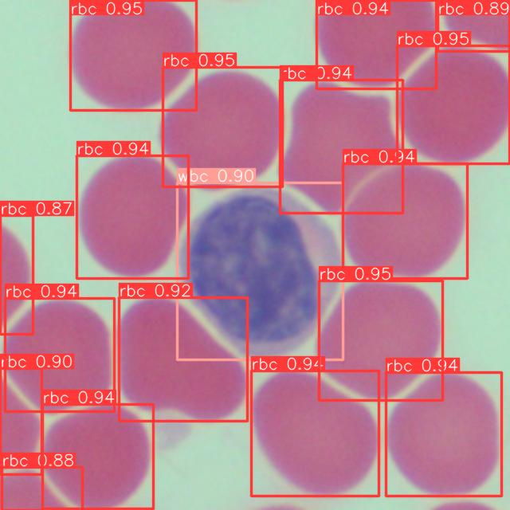
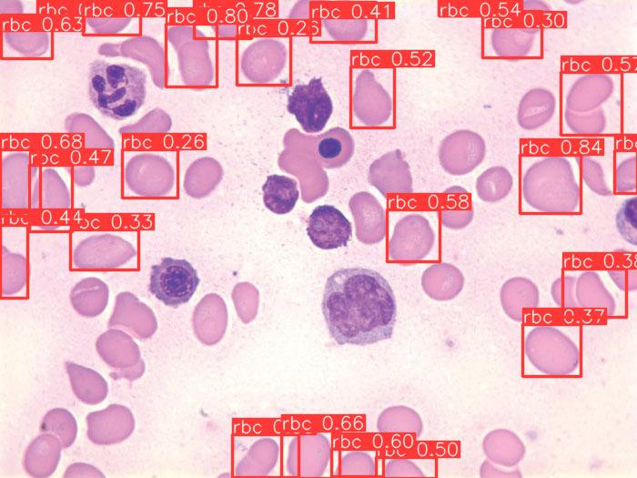
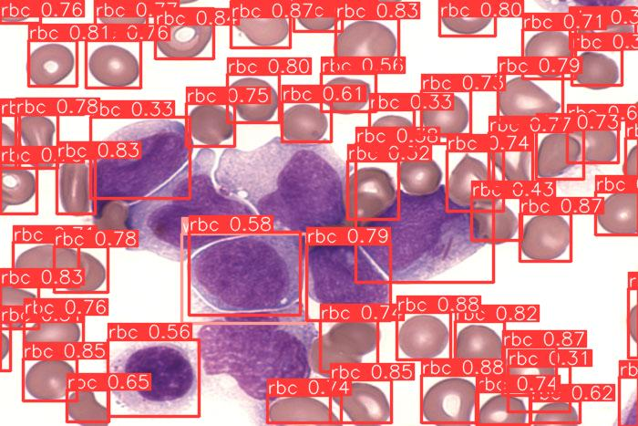
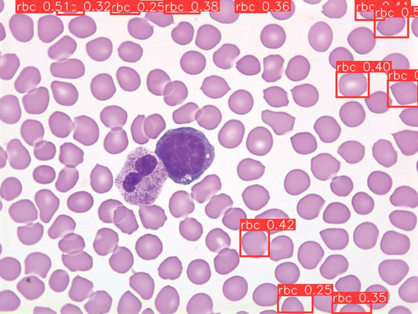
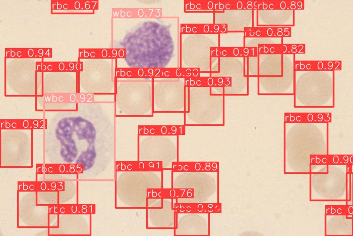
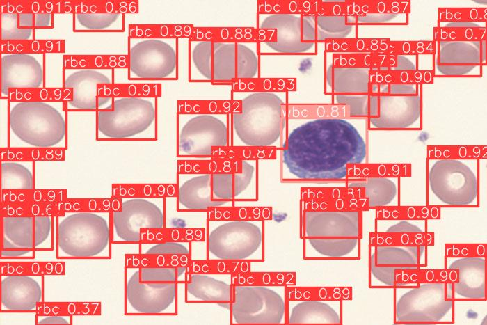

# Blood Cell Classification
White or red blood cell classifier using yolov5

# Datasets
Trained using open dataset from [kaggle](https://www.kaggle.com/datasets/paultimothymooney/blood-cells).
Results presented are excerpts from Anderson's Atlas of Hematology <a href="#ref1" id="ref1">[1]</a>.

# Results

# Citation
<a id="ref1" href="#ref1">[1]</a> Anderson, S. and Poulsen, K. (2013). *Anderson's Atlas of Hematology*. 2nd ed. Philadelphia, PA: Lippincott Williams & Wilkins.
